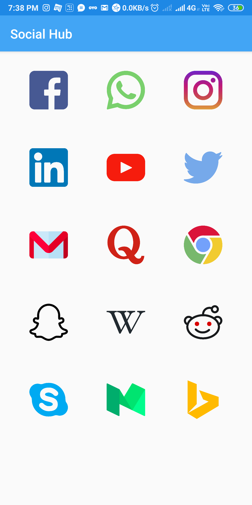

# About
### It is an app which is used to access multiple social networking in a single screen ,one at a time.

## Screenshot

## Tech stack
#### It is based on the application of webview using a link of a particular social network one at a time.
#### It also uses progressDialog to load a particular network.
#### It uses permisson like INTERNET,ACCESS_WIFI,CHANGE_WIFI.